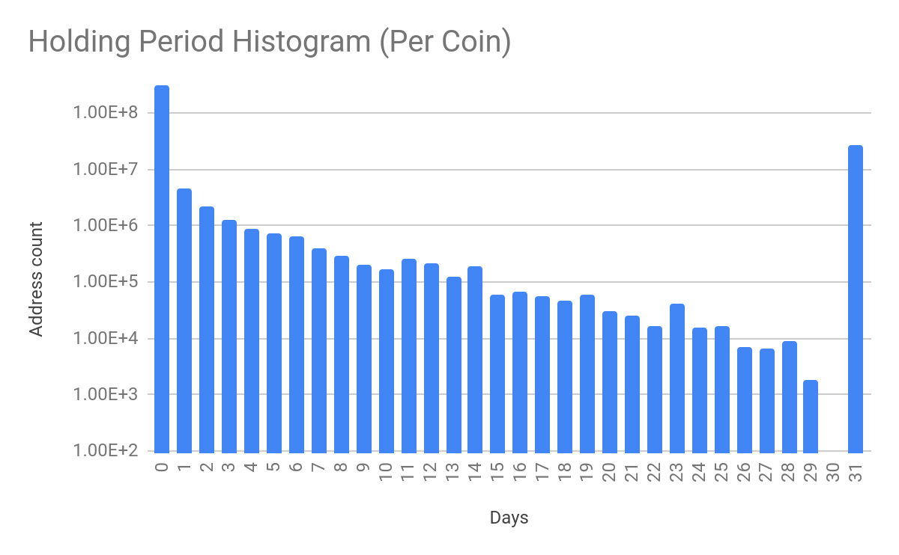
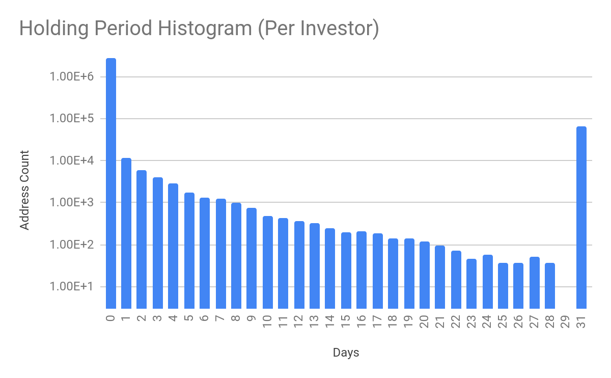

# At a glance

I analyzed all public ethereum transactions from the first month of 2018 to answer the question:

**How long do people hold their Ethereum ?**

Read starting [here](https://github.com/pranavgithub1/Ethereum-Analysis#introduction) for detailed analysis and explanation of methodology.


### Results 

The average holding period across all units of currency was 61.05 hours (~2.5 days) or 8% of the max holding period (31 days).

First: number of 1 ETH units (y-axis) with a given holding period (x-axis). \
Second: number of investors (y-axis) with a given average holding period (x-axis).




---
# Introduction

Ethereum is a cryptocurrency that has seen a massive growth in popularity. Introduced in 2015, an 1 Ethereum was worth about 1 USD. Today, the same unit is worth over 3000+ USD. This meteoric growth reflects broader interest in the blockchain - a technology that allows systems to be decentralized. The mission of cryptocurrencies is to transform banking into a decentralized system, without the need for a central bank through which all transactions pass. Like all missions, it has its supporters and skeptics.

This brings us to the two types of Ethereum investors.

1. True believers - These are investors who believe in the core mission of Ethereum: that there will be widespread adoption of cryptocurrency as the most common form of payment in the future. In this case, the price of Ethereum would skyrocket and the true believers would cash out.
2. non believers - These are people who are just riding the wave. They trade based on fluctuations in Ethereum price in order to make profits. They do not believe in the long term soundness of the investment.

Thus, we can pose some interesting questions. How many people are true believers? How many people are non-believers? How many are in between? How long do people hold on to their Ethereum?

More formally I investigated a couple metrics:

- mean, std, min, and percentiles of the amount of time a unit of currency (1 ETH) spent in a given Ethereum wallet
- mean, std, min, and percentiles of amount of time a wallet held their money
- graphs on these values

  


To understand what exactly these metrics mean let's look at an example.

**Bob's transactions table**

| Date        | Amount (ETH) | Type |
| ----------- | ------------ | ---- |
| Jan 1, 2018 | 1            | BUY  |
| Jan 2, 2018 | 1            | BUY  |
| Jan 3, 2018 | 1            | SELL |

*Table 1*

I defined the lifetime of a unit of ethereum currency on a Last In First Out (LIFO) basis. For example, I assume that the unit of currency Bob bought on Jan 2, 2018 was the one he sold on Jan 3, 2018. Then I label the holding period of this unit of currency as 1 day. Within this time period of 3 days, the unit of currency bought on Jan 1, 2018 has not been relinquished. I label the holding period of this unit as 3 days. I will refer to a unit of 1 ETH as a coin in the rest of this paper.

To answer these questions we can use the power of Google BigQuery. Google BigQuery is a serverless data warehouse that allows scalable and rapid analysis of petabytes of data. Recently BigQuery added the public ethereum [dataset](https://cloud.google.com/blog/products/data-analytics/ethereum-bigquery-public-dataset-smart-contract-analytics), which is an updating dataset that provides data on the Ethereum cryptocurrency.

This is actually a collection of datasets, but the one I used was the transactions dataset. The transactions dataset is essentially just 1.3 billion+ rows of every transaction that has taken place on the Ethereum network.

Each transaction has a sender, receiver, value in Wei, and a block timestamp. Let me clear up some terminology. The sender and receiver are represented by wallet addresses. These are unique addresses you get when you are given a wallet to send and receive ethereum (these addresses look like this: 0x89205A3A3b2A69De6Dbf7f01ED13B2108B2c43e7). The value of the transaction is in Ethereum, but it is in a denomination of Ethereum called Wei. One Wei is about 10^18 ETH. The block timestamp is the timestamp of the block that transaction occurred on in the blockchain. The lifetime of a block on the ethereum network is about 13 seconds so the timestamps not being transaction specific will not affect our study. Ethereum bought and sold within the same block will be labeled as having a holding period of 0 days.

This analysis was conducted on the transaction data for the first month of 2018. This time period is large enough to observe patterns and draw conclusions, while not incurring large costs for processing huge amounts of data.

### The Data

The data used was from the BigQuery public dataset "crypto_ethereum." The table used was the "transactions" table.

Table description:

Each block in the blockchain is composed of zero or more transactions. Each transaction has a source address, a target address, an amount of Ether transferred, and an array of input bytes. This table contains a set of all transactions from all blocks, and contains a block identifier to get associated block-specific information associated with each transaction. Data is exported using https&#x3A;//github.com/medvedev1088/ethereum-etl

The important information fields associated with each transactions are important:

- `transaction_index` : integer index of the transaction on the block
- `from_address` : address of the sender
- `to_address` : address of the receiver
- `value` : value transferred in Wei (10^18 Wei = 1 ETH)
- `block_timestamp` : timestamp of the block this transaction was on
- `receipt_status` : 1 or 0 corresponding to success or failure of the transaction


# Preprocessing

Formally the goals of my program were:

- **Input :transaction log of transactions described above**

- **Output 1(currency log):**

  - address, acquisition time, relinquishment time, and holding period for each coin

- **Output 2(investor stats):**

  - stats on the holding period for each investor
  - count, mean, std, min, max, percentiles

A considerable amount of preprocessing needed to be done in order to extract information about the lifetime of a given 1 ETH coin.

First of all we need to convert all the values from Wei into ETH. Since 10^18 Wei = 1 ETH this is as simple as dividing each value by 10^18. I also truncate the decimal since I am only interested in the lifetime of a unit of a 1 ETH unit. We also need to ignore all rows in our range that represent failed transactions.

I found out the lifetime of each coin using the method described for Bob's transactions above. However the challenge is that the Ethereum network doesn't just have "Bob" on it. It has millions of unique wallets.

There were a two main steps that needed to be taken in order to get the data ready for the holding period calculation (I will go into more detail on these steps later) :

1. We need the transaction data in a form as shown in table 1 but for each unique wallet. Thus a new dataset is created that is grouped by wallet and is ordered by timestamp. This dataset will essentially hold a log of all the transactions for every investor in the time period. Each transaction in the original dataset has exactly 2 wallets associated with it - sender and receiver. Therefore each transaction in the original dataset must appear exactly twice in our new dataset. Once as type "BUY" (acquisition) in the receiver's section and another as type "SELL" (relinquishment) in the sender's section.


2. Now we have a set of acquisition and relinquishment transactions for each wallet. This is starting to look like our example table, but not quite. It needs to be "unrolled." For example, a single entry such as

| Jan 1, 2018 | 3 ETH | BUY |
| ----------- | ----- | --- |

Needs to be transformed into 3 rows - 1 row for each 1 ETH unit in the value.

| Jan 1, 2018 | 1 ETH | BUY |
| ----------- | ----- | --- |
| Jan 1, 2018 | 1 ETH | BUY |
| Jan 1, 2018 | 1 ETH | BUY |

After this we will have a table such as table 1 for each wallet. Then using the LIFO process described in the example, we process the data and get the holding period of each coin.

### Tech stack

Python in conjunction with data science libraries such as Pandas and NumPy could be used for the entirety of the process however I was limited by the 16gb of memory in my laptop and time. Python is very slow at processing big data. In order to be most efficient I needed to get as much of the processing done in the cloud as possible.

The first step of the preprocessing - creating the individual wallet datasets - was manageable with SQL in Google BigQuery's SQL interface.

However, Python is needed for the LIFO. We will use Python with the libraries NumPy and Pandas.

  
  
  
  
  
  
  


### Step 1

Again step 1 was to transform the raw list of {from_address, to_address, value} transactions into a dataset of the transactions (buy or sell) associated with any given wallet.

Consider the following example

**Ethereum Public Ledger**

| From address | To Address | Value | Block Timestamp | Block index |
| ------------ | ---------- | ----- | --------------- | ----------- |
| John         | Paul       | 1     | 1/1/2018        | 0           |
| Paul         | Pranav     | 2     | 1/1/2018        | 1           |
| Pranav       | John       | 5     | 1/3/2018        | 0           |

  
  
  
  
  
  
  


Is transformed into:

| Address | value | type | Block timestamp | Block Index |
| ------- | ----- | ---- | --------------- | ----------- |
| Pranav  | 2     | BUY  | 1/1/2018        | 1           |
| Pranav  | 5     | SELL | 1/3/2018        | 0           |
| John    | 1     | SELL | 1/1/2018        | 0           |
| John    | 5     | BUY  | 1/3/2018        | 1           |
| Paul    | 1     | BUY  | 1/1/2018        | 0           |
| Paul    | 2     | SELL | 1/1/2018        | 1           |

  


I used the following SQL query to achieve that:

```sql
WITH transactions as (

SELECT from_address as address, block_timestamp, transaction_index, from_address, to_address, value/POWER(10,18) as value, 0 as type

FROM `bigquery-public-data.crypto_ethereum.transactions` WHERE block_timestamp BETWEEN '2018-01-01 00:00:00 UTC' AND '2018-01-31 23:59:59 UTC' AND value>=10E18 AND from_address IS NOT NULL AND to_address IS NOT NULL AND receipt_status=1

UNION ALL

SELECT to_address as address, block_timestamp, transaction_index, from_address, to_address, value/POWER(10,18) as value, 1 as type

FROM `bigquery-public-data.crypto_ethereum.transactions` WHERE block_timestamp BETWEEN '2018-01-01 00:00:00 UTC' AND '2018-01-31 23:59:59 UTC' AND value>=10E18 AND from_address IS NOT NULL AND to_address IS NOT NULL AND receipt_status=1

)

SELECT * FROM transactions ORDER BY address ASC,block_timestamp ASC,transaction_index ASC
```
The `SELECT` statements grab all the desired rows, then use a `BETWEEN` command in order to single out the first 31 days of 2018, and also only takes values greater than 1 ETH.

The second `SELECT` statement does the same thing.

The two `SELECT` statements combined with the  `UNION ALL` duplicate each row since we know each row in the original dataset needs to appear twice in the new dataset. Notice that the first select statement labels the type as 0 (sell) and selects from_address and the second labels the type as 1 (buy) and select to_address. This makes sense because each row in the original dataset is a buy for the to_address wallet and a sell for the from_address wallet.

Then we take all of this and order it by address, then order it chronologically using the block_timestamp and transaction index.

This data is ready to feed into the program that will calculate the holding period.

  


### Step 2

All the data just preprocessed in step 1 was in the cloud. I needed to get it on my computer to work with it using python. First I exported the query results from the query in step 1 to a separate BigQuery table. From there I exported it to a Google Cloud Storage bucket in the form a multiple csv files, since the max export size for csv is 1gb.

These files were then combined and I was able to download all the data to my PC. We will call this input data "transactions.csv". The total size of the data was about 2GB with 11,621,110 rows and 2,952,653 unique addresses represented. This does not seem like much, but the rows still have to be "unrolled" to have each row representing a single ethereum coin. This will drastically increase the size of the data. 

  


Pandas, the data science library for Python that I used, loads data fully into memory before working with it. Therefore memory was a constraint. 2GB could be easily loaded into memory for me, but as mentioned the unrolling step would exceed memory. Therefore I had to process the data in chunks. This memory problem further justifies limiting this proof-of-concept to the first month of 2018. In addition, the program took a long time to run (5+ hours). The more data, the more time it would take to run, and the longer it woudl take to debug.

At first I had tried processing the whole file at once, but the program always exceeded memory when unrolling.

Therefore I opted for processing the data one wallet at a time. Since the CSV file is sorted by wallet, I wanted to stream through the transactions.csv file and process the holding period stats for the first wallet. Then remove that data from memory and go to the second wallet, etc. The reason I did not just make a separate csv file for each wallet is because there were almost 3 million unique wallets.

Unfortunately I found out that this sort of looping through a csv file was not possible in Pandas without loading it all in memory which would defeat the purpose. However, the `read_csv()` function from pandas allows you to loop through the csv file in chunks, only loading the chunksize in memory at any given time. Therefore I looped through transactions.csv in chunks of 10,000 lines.

However each chunk of 10,000 lines may not line up perfectly with a given address. I did not want addresses split between the tail of one chunk and the head of the next. Therefore, beginning with the first chunk I stored any tail-end orphans at the end of a chunk outside the loop, and then appended them to the head of the next chunk. This way the DataFrame I was processing had all the transactions associated with any address in it - none cut off.

The data was then unrolled and fed into the holding period calculation function.


# Holding Period Calculation

### Algorithm

The holding period was calculated assuming, for a given wallet, the last coin bought is the first coin to be sold. This is explained in Bob's example above (see table 1). I tried doing this with pure python but since this was a heavy looping calculation it turned out to be very slow. I decided to use Cython since I wanted to learn it anyway, and it would speed up the process a lot.

The logic is as follows:

Loop through the transactions. If type is BUY, add the transaction to the stack (a Last In First out data structure) . If type is SELL, pop the top of the stack which would be a BUY transaction. Then subtract the timestamps to get the holding period of the coin associated with those transactions.

### Output 1 (currency log) :

I keep track of 4 values for every coin:

- `address` that owns this coin
- `acquisition timestamp`
- `relinquishment timestamp`
- `holding period` (relinquishment -acquisition)

This becomes the currency log - the first output of the program.

  
  
  
  
  
  
  


### Output 2 (investor stats) :

Taking the currency log and grouping by address, we can take stats over the holding period for each investor. Then we can find the number of holding periods for that address (the number of coins), mean holding period, min holding period, etc. This gives us the investor stats table with the following columns:

- count
- mean
- std
- min
- percentile_25
- percentile_50
- percentile_75
- max


# Data analysis

Both outputs were uploaded from CSV files on my computer to BigQuery tables for easy querying and analysis.

### Results

There were 2,952,653 unique wallets that completed transactions for the first month of 2018.

The average holding period across all units of currency was 61.05 hours (2 days 13 hours) or 8% of the max holding period (31 days).

**Percentiles of holding_period in currency log**

| **0th** | **10th** | **20th** | **30th** | **40th** | **50th** | **60th** | **70th** | **80th** | **90th** | **100th** |
| ------- | -------- | -------- | -------- | -------- | -------- | -------- | -------- | -------- | -------- | --------- |
| 0.0     | 0.06083  | 0.07361  | 0.08194  | 0.09     | 0.10166  | 0.12972  | 0.17805  | 0.49333  | 45.7394  | 744       |

**Mode: 744**

  


**Percentiles of min holding period in investor stats**

| **0th** | **10th** | **20th** | **30th** | **40th** | **50th** | **60th** | **70th** | **80th** | **90th** | **100th** |
| ------- | -------- | -------- | -------- | -------- | -------- | -------- | -------- | -------- | -------- | --------- |
| 0.0     | 0.0488   | 0.0630   | 0.0716   | 0.0783   | 0.0847   | 0.0936   | 0.1133   | 0.1605   | 0.26     | 744.0     |

**Mode: 744**

  
  

<!-- 
 -->


  
  
  
  
  
  
  
